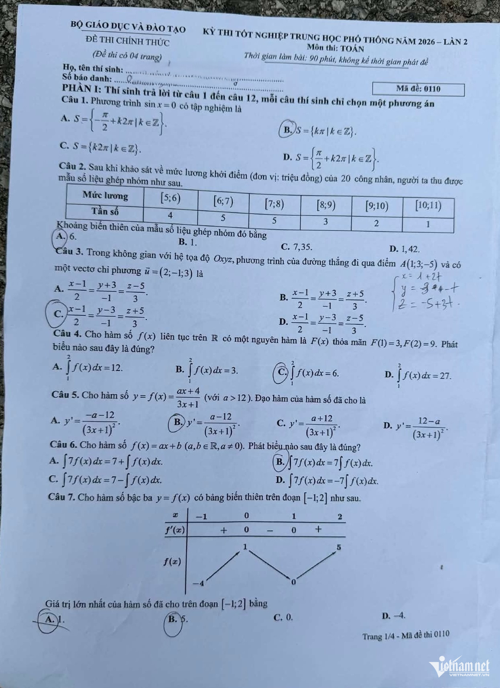
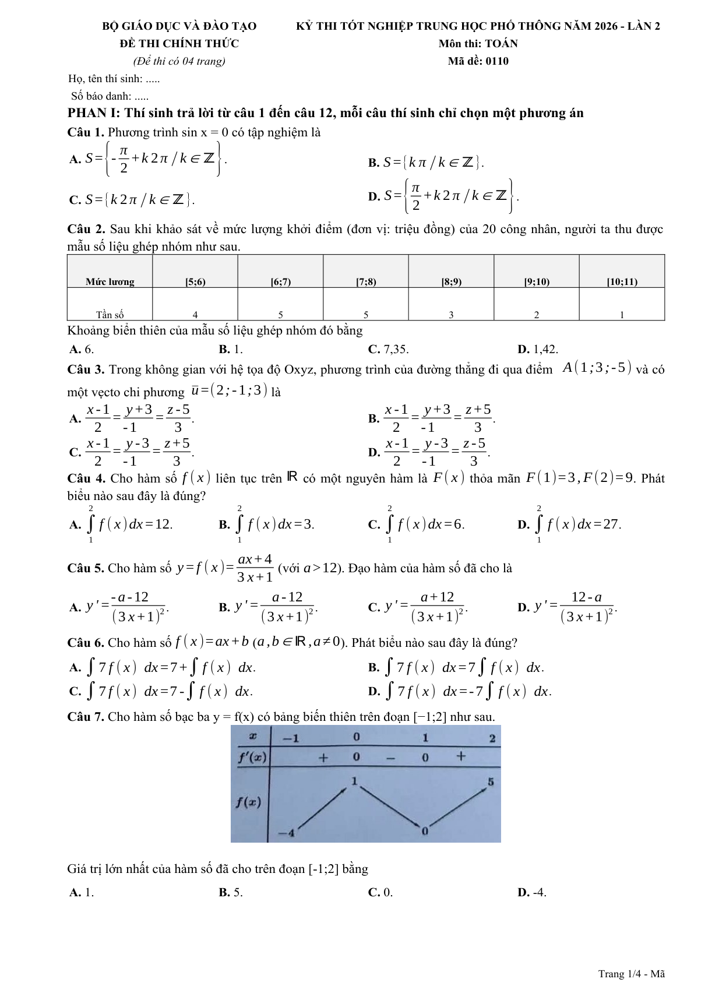
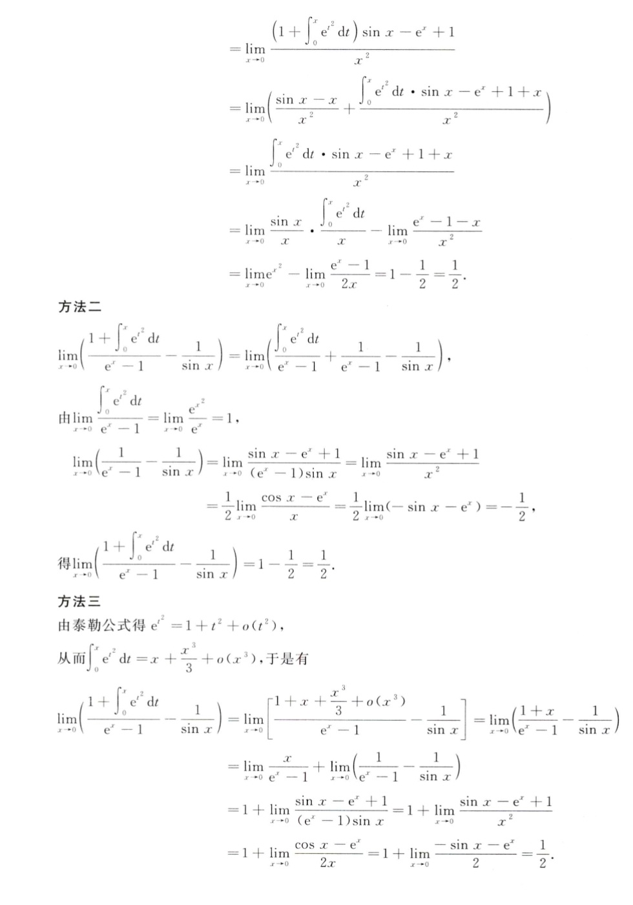
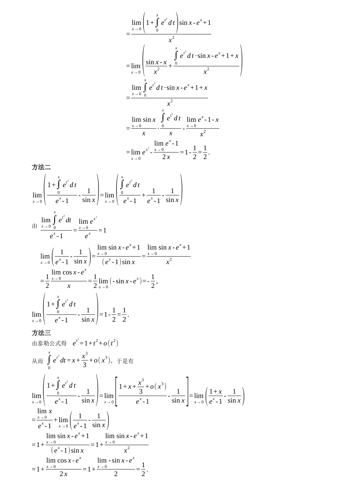
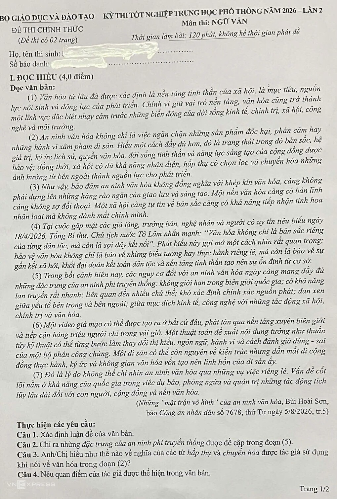
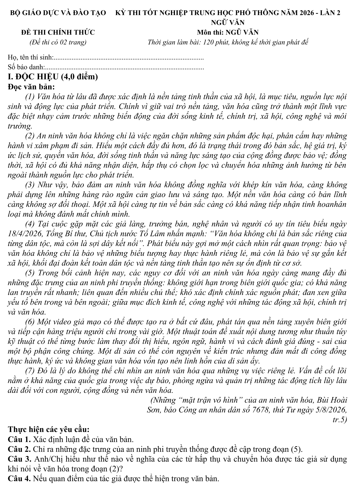

# docreconstruct — 简体中文指南

[英语](../../README.md) · [越南语](README.vi.md) · **简体中文** ·
[俄语](README.ru.md)

`docreconstruct` 可将 PDF、扫描件和文档照片重建为结构清晰、可继续编辑的
文档。在整个流程中，OCR 结果只是用于核对的输入之一，并非最终成品。项目
会通过统一的文档模型、版面规划和输出模块生成 DOCX 文档、网页或 JSON 数据。

## 公开基准测试现状

真值辅助重建测试（`oracle_reconstruction`）已经覆盖 OmniDocBench 官方演示集
的**全部 18 页**。它使用标准 Markdown 和标准几何标注来单独考察重建能力，
因此**不是** OCR 对比测试。

| 结果 | 实测值 |
| --- | ---: |
| 修复投影后成功运行 | **18/18（100%）** |
| 通过全部已测验收条件 | **2/18（11.11%）** |
| 严格证据对齐失败 | **0/18** |
| LibreOffice 图像指标 v2.2（计入全部 18 页） | **0.214798** |

原先的 10 个失败来自 OmniDocBench 转换过程中页面宽高被颠倒，并非模糊文本
匹配器本身失效。修正投影且不放宽严格模式后，18 页均能生成 DOCX，但仍只有
两页通过所有条件，说明版面规划与文档重建质量依然不足。请查看[新版报告和逐页
失败清单](../../benchmark/omnidocbench-demo/projection-0.2-metric-2.2/README.md)，
以及为便于追溯而保留的[旧基线](../../benchmark/omnidocbench-demo/README.md)。
图像指标 2.1 与 2.2 不能直接比较。

仓库现已包含只读取原始文档的测试工具和免费的本地 Tesseract 路线，但 296 页
困难集与 1,651 页全集尚未跑完。因此目前仍不能宣称优于 Docling、MinerU 或
Marker。

## 网页界面与文件上传

GitHub Pages 部署完成后，可通过
[kayurachann.github.io/docreconstruct](https://kayurachann.github.io/docreconstruct/)
访问静态网页界面。该页面只是浏览器端界面，并非托管式文档重建服务。
GitHub Pages 无法运行 Python、LibreOffice、Triton、vLLM 或 GPU OCR 模型；
本仓库也不附带公共后端，更不提供不限量的免费 GPU 算力。

使用该界面时，用户必须选择由可信机构运营的后端。高质量模式需要同时提供
校对后的 Markdown、原始 PDF 或图像以及带位置信息的 JSON。用户既可以上传
已有 JSON，也可以主动选择在线 OCR 服务生成 JSON。任何文件离开设备之前，
界面都会说明接收方并要求用户确认。更改后端地址或 OCR 选项后，必须重新确认。
数据保留期限、隐私保护、处理地区、使用限额和费用均由相应运营方决定。详情参见
[性能与部署说明](../PERFORMANCE.md)。

## 推荐的三类输入

高质量模式只有在以下三类相互补充的输入都齐全时才会开始。三者各有用途，
不能简单地互相替代：

| 输入 | 项目以此作为判断依据的内容 |
| --- | --- |
| 已人工校对的 `content.md` | 准确的文字内容和预期阅读顺序；项目不会擅自改写或补写文字 |
| 一个或多个由 OCR/版面分析服务生成的 `.json` 文件 | 页面与内容块的对应关系、坐标、内容类型、表格、公式、格式、识别置信度以及来源信息 |
| 原始 PDF 或图像 | 实际页面尺寸、视觉外观、分栏、表格、插图以及需要取用的原图区域 |

项目会先分别对每个 JSON 文件进行规范化和对齐，再综合各来源的信息。JSON
可以补充版面和结构信息，但不能覆盖 Markdown 中的文字；原始文件则始终是
页面外观和几何尺寸的最终参照。与当前文档无关或存在冲突的 JSON 会被拒绝，
或者在 QA 报告中明确列出。只含零散文字的 JSON 不算位置证据：每个可用内容
块都必须注明所属页面、页面尺寸以及边界框或多边形坐标。如果缺少其中一类
输入，项目仍可按估算模式运行，但输出只能视为可信度较低的结果，不能称为
高质量结果。

### 还没有位置 JSON？

用户可以打开服务商的官方网站自行导出文件，也可以通过可信后端使用自己的
账号和密钥。请勿把共用密钥写进 GitHub Pages 的 JavaScript。限额、价格和政策
都可能调整，因此上传前应以官方网站以及用户账号中显示的条款为准。

| 选择 | 适合处理 | 使用前需要了解 |
| --- | --- | --- |
| [PaddleOCR 官方接口 / AI Studio](https://www.paddleocr.ai/latest/en/version3.x/inference_deployment/serving/paddleocr_official_api/overview.html) | 多语言扫描件、拍摄变形的页面、表格和公式，可同时输出 Markdown 与 JSON | 使用用户自己的 AI Studio 权限。[现行限额说明](https://ai.baidu.com/ai-doc/AISTUDIO/pmjcld5qm)为每位用户、每个模型每日 3,000 页；文件超过 100 页时只处理前 100 页。这是可调整的用量限额，不是可用性承诺。所引接口文档没有给出 PaddleOCR 专属的数据保留期限，敏感文件上传前应先阅读百度现行政策。 |
| [Mistral OCR](https://docs.mistral.ai/api/endpoint/ocr) | 复杂页面、结构化 Markdown 和位置数据 | 需要用户自己的密钥，并把文件上传到 Mistral。[价格页](https://mistral.ai/pricing/api/)按页计费；试用额度和速率限制取决于账号，不能视为有保障的免费生产算力。[零数据保留](https://help.mistral.ai/en/articles/347612-can-i-activate-zero-data-retention-zdr)仅适用于符合条件的付费方案，也不覆盖所有文件上传或批处理路径。 |
| [Mathpix](https://docs.mathpix.com/) | 数学公式、理工科资料和手写内容 | [不提供免费试用](https://website.mathpix.com/docs/convert/billing)，并收取开户和使用费用。Mathpix 明确要求[不得在浏览器代码中暴露密钥](https://docs.mathpix.com/reference/authentication)，因此 PDF 处理需要可信后端。[保留政策](https://docs.mathpix.com/concepts/data-retention)目前注明源图像最长保留 30 天、识别文字最长保留 90 天。 |
| [Azure 文档智能](https://learn.microsoft.com/en-us/azure/ai-services/document-intelligence/prebuilt/layout?view=doc-intel-4.0.0) | 表单、表格、阅读顺序、Markdown 和多边形坐标 | 需要用户自己的 Azure 资源和凭据。[F0 限额](https://learn.microsoft.com/en-us/azure/ai-services/document-intelligence/service-limits?view=doc-intel-4.0.0)目前为每月 500 页，但每次请求只处理前两页。微软说明分析数据会在所选区域暂存，并在 [24 小时内删除](https://learn.microsoft.com/en-us/azure/ai-services/document-intelligence/faq?view=doc-intel-4.0.0)。 |
| [Google Document AI](https://docs.cloud.google.com/document-ai/docs/overview) | 企业文档识别、表单和详细坐标数据 | 需要 Google Cloud 项目、处理器、结算账号和 OAuth 权限。[价格页](https://cloud.google.com/products/document-ai/pricing)目前规定每个账号每月前 1,000 页企业文档 OCR 不收费，之后按量计费。Google 表示[不会使用客户文档和预测结果训练 Document AI](https://docs.cloud.google.com/document-ai/docs/security)。项目需要把返回的 Document JSON 转成 Markdown。 |
| [OCR.space](https://ocr.space/ocrapi) | 短小且不敏感、希望由浏览器直接提交的文件 | 免费方案目前限制为每个 IP 每日 500 次、每月 25,000 次、每个文件 1 MB、PDF 最多三页，并且没有可用性承诺。必须使用用户自己的密钥；浏览器中的密钥仍可能被复制并耗尽额度。服务商声明不会保存源文件和 OCR 文字。 |
| [olmOCR](https://github.com/allenai/olmocr) | 困难 PDF、手写、数学、表格和多栏阅读顺序 | Apache-2.0 开源代码不等于免费托管算力。本地运行需要合适的 GPU，外部推理服务另行收费。[在线演示](https://olmocr.allenai.org/)仅供试用，没有公开的生产接口或可用性承诺。 |
| [Hugging Face Spaces 公开演示](https://huggingface.co/spaces/PaddlePaddle/PaddleOCR-VL-1.6_Online_Demo) | 部署前试用模型 | [ZeroGPU](https://huggingface.co/docs/hub/main/spaces-zerogpu)按账号提供少量每日 GPU 分钟数，并有排队和运行时长限制；[专用推理端点](https://huggingface.co/docs/inference-endpoints/en/pricing)需要付费。不得把公开演示当作项目默认的生产后端。 |

在本项目中，`paddleocr_official` 按照[官方工具包](https://www.paddleocr.ai/latest/en/version3.x/inference_deployment/serving/paddleocr_official_api/python.html)
读取 `PADDLEOCR_ACCESS_TOKEN`，向 AI Studio 提交异步任务。它不同于
`paddleocr_vl_server`；后者连接的是由后端运营方自行选择和管理的
PaddleOCR-VL 服务器。运营方可用 `DOCRECONSTRUCT_PUBLIC_OCR_PROVIDERS`
公布一份小型允许列表。`/v1/hybrid/capabilities` 只把允许且已配置的服务标为
可用，不会返回密钥、访问令牌或私有服务地址。

默认情况下，来源文件中的页码必须准确对应。只有当两个页面序列都完整、
连续且页数相同，项目才会按先后顺序重新配对，例如把 OCR 标记为第 5–6 页
的内容对应到编号为第 1–2 页的两张裁剪图。每次重新配对都会在检查报告中
留下警告。项目绝不会猜测缺页或页码不连续的序列。各 OCR 来源使用的坐标
单位和预处理信息也会保留下来，以便将位置正确换算回原始页面。

```powershell
docreconstruct hybrid content.md original.png `
  --evidence paddleocr.json `
  --evidence mineru.json `
  --output output/result.docx `
  --qa-report output/result.qa.json
```

可以多次使用 `--evidence`，同时引入彼此独立的识别结果。如果项目无法可靠
判断 JSON 的数据结构，请明确指定它来自哪个 OCR 服务，不要让项目猜测：

```powershell
docreconstruct hybrid content.md original.pdf `
  --evidence result.json `
  --evidence-provider result.json=paddleocr `
  --output output/result.docx
```

### 多页原始文档

处理多页 PDF 时，项目会逐页分析并分别规划版面。原件中的每一页都会生成
一个独立的 Microsoft Word 分节，保留相应的物理页面尺寸，并强制从新页
开始。如果不同页面上的独立证据能够确认内容确实延续，同一语义组可以跨页；
空白页或被 OCR 遗漏的页面仍会保留为空节，不会把后一页的内容错误移到前面。
默认 QA 会检查规划出的节数；显式启用 LibreOffice 检查后，还会要求渲染页数
与原件页数完全一致。

```powershell
docreconstruct hybrid complete-document.md multi-page-original.pdf `
  --evidence provider-result.json `
  --output output/complete-document.docx `
  --qa-backend libreoffice `
  --qa-report output/complete-document.qa.json
```

## 快速安装

```powershell
python -m pip install -e ".[hybrid]"
docreconstruct hybrid content.md original.png -o output/result.docx
```

只有在用户主动启用图像对比检查时，项目才会调用 LibreOffice 进行文档
渲染：

```powershell
docreconstruct hybrid content.md original.png -o output/result.docx `
  --qa-backend libreoffice `
  --min-visual-score 0.80 `
  --qa-report output/result.qa.json
```

## 成功重建示例

这些文件均由 CLI 所使用的同一套通用重建流程生成。这里同时提供高分辨率
原图、可下载的可编辑 DOCX 文件和项目生成的渲染预览，便于您直接核对实际
效果，而不必仅凭截图判断。文件来源详情见[示例文件说明](../showcases/README.md)，
精确校验值见 [SHA-256 清单](../showcases/SHA256SUMS.txt)。

> **务必核验：** OCR 结果以及识别服务导出的 Markdown 可能含有拼写、变音
> 符号、公式、表格或阅读顺序错误。由于 Markdown 是文字内容的最终依据，
> DOCX 文件也可能原样保留这些错误。在依赖可编辑结果之前，请务必逐项对照
> 原图。

### 宣光省重点中学数学考试——第 1 页，试卷代码：0110（来源：VietnamNet）

**来源：** [VietnamNet](https://vietnamnet.vn/)；此署名由贡献者提供，相关
权利说明见[示例文件说明](../showcases/README.md)。

| 拍摄的原始试卷页 | 项目从可编辑 DOCX 文件生成的预览 |
| :---: | :---: |
| [](../showcases/math-exam/source-original.png) | [](../showcases/math-exam/rendered-preview.png) |

**相关文件：** [原图](../showcases/math-exam/source-original.png) ·
[可编辑 DOCX 文件](../showcases/math-exam/editable.docx) ·
[渲染预览](../showcases/math-exam/rendered-preview.png)

此示例展示了实拍页面、结构复杂的页眉、Microsoft Word 原生表格、可编辑的
原生公式、四选一选项布局，以及对原图中函数变化表的复用。手写内容、照片
透视畸变、OCR 漏识别的文字和某些页面装饰不保证能够重建为可编辑内容。

### 微积分推导——可编辑的 Microsoft Word 原生公式（来源：PaddleOCR）

**来源：** [PaddleOCR](https://github.com/PaddlePaddle/PaddleOCR)；OCR 结果及
导出内容的出处说明由贡献者提供。

| 原图 | 项目从可编辑 DOCX 文件生成的预览 |
| :---: | :---: |
| [](../showcases/calculus-derivation/source-original.jpg) | [](../showcases/calculus-derivation/rendered-preview.png) |

**相关文件：** [原图](../showcases/calculus-derivation/source-original.jpg) ·
[可编辑 DOCX 文件](../showcases/calculus-derivation/editable.docx) ·
[渲染预览](../showcases/calculus-derivation/rendered-preview.png)

此示例展示了分数、积分、极限、上下标、对齐推导和中英文混排中的可选择、
可编辑原生公式。通用版面规划器将 10 个可编辑内容块映射到原图中的全部
18 行内容；最终 DOCX 文件渲染为一页，保留 8 个原生公式和 13 行独立展示
内容，且不会露出公式排版用的对齐标记。项目 QA 的 34 项实测检查全部通过，
前景归一化视觉相似度为 92.58%。该分数只能说明效果有所改善，不能证明每个
字形或数学陈述在语义上都正确。

### 宣光省重点中学——越南语第二次考试（来源：VNExpress）

**来源：** [VNExpress](https://vnexpress.net/)；此署名由贡献者提供，相关
权利说明见[示例文件说明](../showcases/README.md)。

| 原图 | 项目从可编辑 DOCX 文件生成的预览 |
| :---: | :---: |
| [](../showcases/vietnamese-exam/source-original.png) | [](../showcases/vietnamese-exam/rendered-preview.png) |

**相关文件：** [原图](../showcases/vietnamese-exam/source-original.png) ·
[可编辑 DOCX 文件](../showcases/vietnamese-exam/editable.docx) ·
[渲染预览](../showcases/vietnamese-exam/rendered-preview.png)

此示例展示了双区域试卷页眉、越南语衬线字体、缩进并两端对齐的文章段落、
出处标注位置、供考生填写信息的点线和可编辑题目。OCR 仍可能产生拼写及
变音符号错误；原图水印、已遮盖的考生信息和其他仅以像素图像存在的标记，
不会被悄然重建为可编辑文字。

上述来源署名由贡献者提供，仅用于记录贡献者所提供的出处信息，既不授予
再使用许可，也不代表原出版机构或 OCR 项目认可或推荐 `docreconstruct`。
项目代码的许可证不会自动授予对这些第三方试题内容、标志、水印、手写内容
或其他素材的使用权；原有权利仍归各权利人所有。重新分发或使用任何示例文件
前，请自行核查相关权利和隐私要求。

## 必须人工复核的限制

- OCR 或 Markdown 可能会漏掉内容，也可能错误识别拼写、变音符号、数字、
  标点、科学记号、数学运算符和手写文字。
- 公式即使保持可编辑，也可能在运算符、括号、对齐位置、极限位置或换行处
  出错。
- 表格、分栏、阅读顺序、字体、间距、插图、页眉、页脚和分页效果可能在
  原件、Microsoft Word 与 LibreOffice 之间有所不同。
- OCR 来源给出的置信度和通过自动 QA 检查只能作为参考，不能证明数学、
  法律或其他专业内容正确无误。
- 如果 Markdown 与原件不一致，组合流程仍以 Markdown 的文字为准，不会
  擅自猜测或修改内容。
- 逐像素复刻原件与使用 Microsoft Word 原生对象实现深度编辑有时是相互
  冲突的目标。本项目无法保证对所有文档都做到 1:1 重建。

在考试、档案、法律、医疗、金融、合规或其他重要场景中使用之前，请务必
逐项对照原件，并请相关领域的专业人员复核。

如需了解完整的编程接口、支持的 OCR 来源、系统架构、参考项目、隐私说明和
许可证，请阅读[英语版说明文档](../../README.md)。
